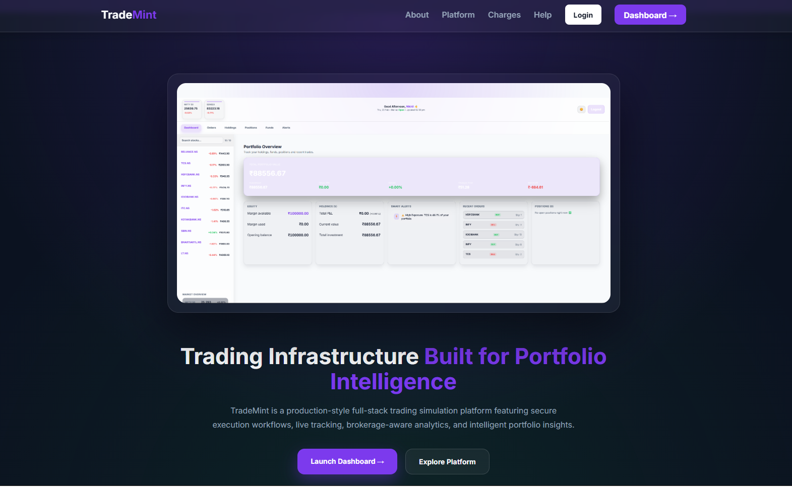
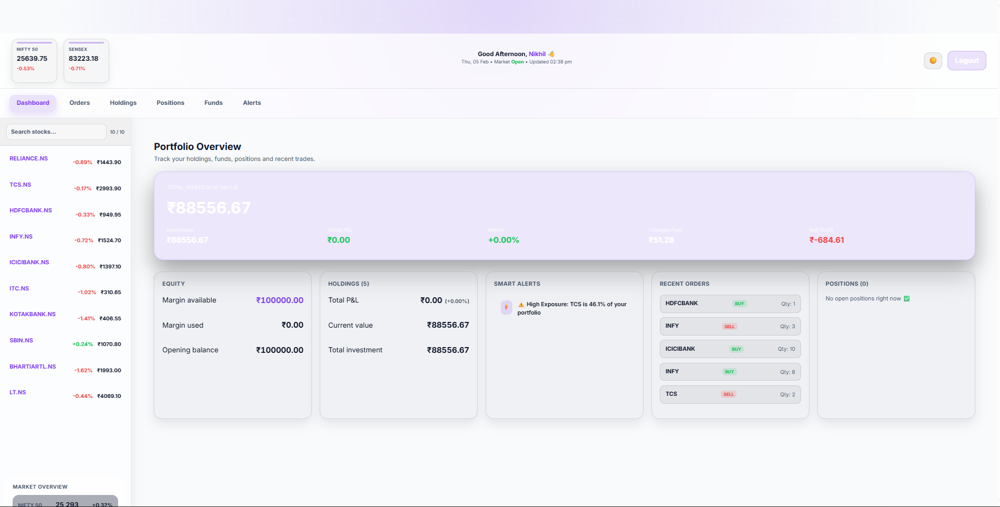
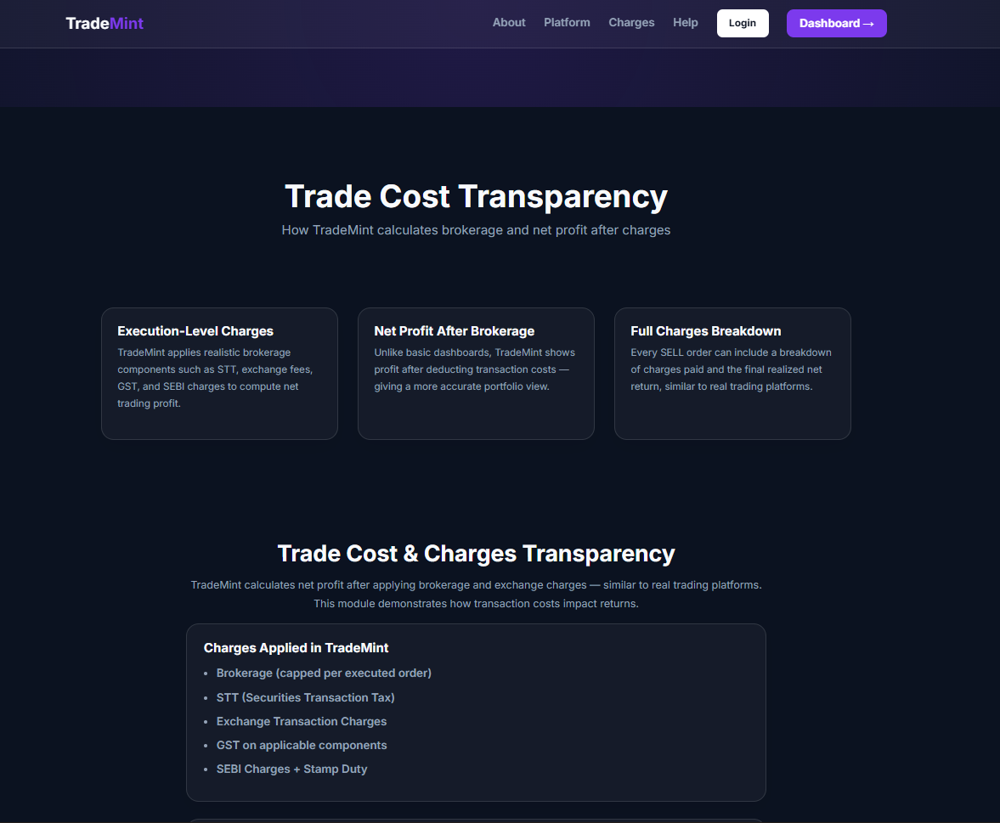
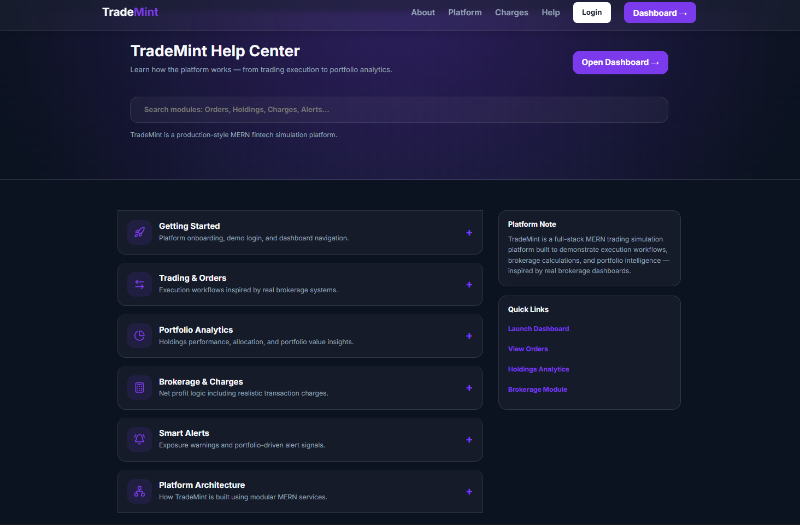

# TradeMint 🚀  
**TradeMint** is a full-stack MERN trading simulation platform designed to demonstrate how modern brokerage systems handle **order execution, portfolio tracking, and brokerage-aware profit calculation**.

It focuses on **real trading logic and production-style backend architecture**, not just UI — making it an internship-ready fintech engineering project.


---

## ✨ Core Highlights

### 🔐 Secure Authentication
- JWT **httpOnly cookie-based authentication**
- Protected frontend & backend routes
- Session restoration via `/auth/me`
- Secure logout handling

### 📈 Trading Execution System
- Buy/Sell order placement workflow
- Holdings & positions tracking
- Order history with execution logic
- User-level portfolio management

### 💰 Brokerage-Aware Profit Engine
Unlike basic dashboards, TradeMint calculates:

✔ Gross Profit  
✔ Brokerage & exchange charges  
✔ Taxes (GST, STT, etc.)  
✔ **Net Profit after charges**

This mirrors how real brokerage apps compute returns.

### 📊 Portfolio Analytics
- Real-time portfolio value tracking
- Individual stock P&L
- Investment vs current value comparison

### 🔔 Smart Portfolio Insights
- Exposure monitoring
- Activity tracking
- Performance-focused dashboard design

### 🌐 Live Market Data
- Integrated **Yahoo Finance API**
- Dynamic quote fetching
- Real-time portfolio updates

---## 📸 Platform Screenshots

### 🏠 Landing Page — Platform Overview
Entry point showcasing TradeMint’s purpose, architecture focus, and dashboard preview.  


### 📊 Dashboard Overview
Central portfolio dashboard with investment summary, P&L, alerts, and recent activity.  


### 📈 Holdings & Portfolio Analytics
Detailed holdings table with allocation charts and real-time portfolio value tracking.  


### 📝 Orders & Trade Execution
Buy/sell execution workflow with order history and status tracking.  


### 💰 Brokerage & Charges Transparency
Execution-level charge breakdown showing net profit after brokerage and taxes.  


### 🔔 Smart Alerts & Insights
Portfolio-driven alerts including exposure warnings and performance signals.  


### 🆘 Help Center
Structured documentation explaining platform modules and internal workflows.  


### 🧠 Backend Architecture
High-level system design showing API layers, services, and data flow.  

- **Zod validation** for critical request payloads (orders, authentication)
- Secure cookie-based JWT authentication middleware
- Modular business logic for trade execution & portfolio updates

---

## ⚙️ Backend Architecture

TradeMint follows a **production-style backend structure**:

```
Routes → Controllers → Services → Models → Database
```

- REST API communication between React and Node.js
- User-level data separation using `userId`
- MongoDB schemas for Orders, Holdings, Positions
- Middleware-based authentication & request handling

---

## 🛠 Tech Stack

### Frontend
- React.js
- React Router
- Context API
- Bootstrap

### Backend
- Node.js
- Express.js
- JWT Authentication (httpOnly cookie-based)
- Zod schema validation
- In-memory caching layer
- Middleware-based architecture

### Database
- MongoDB + Mongoose

### Tools & Deployment
- Git & GitHub
- Postman
- Render (Backend Deployment)
- AWS Amplify (Frontend Hosting)

---

## 📂 Project Structure

```
TradeMint/
│
├── backend/     # Node.js + Express REST API
└── dashboard/   # React frontend application
```

---

## ⚡ Getting Started

### 1️⃣ Clone the Repository
```bash
git clone https://github.com/Manideepsainell/TradeMint.git
cd TradeMint
```

---

### 🔧 Backend Setup

```bash
cd backend
npm install
```

Create a `.env` file:

```env
PORT=8000
MONGO_URI=your_mongodb_connection_string
JWT_SECRET=your_jwt_secret
CLIENT_URL=http://localhost:3000
```

Run backend:

```bash
npm start
```

Backend runs on:  
👉 `http://localhost:8000`

---

### 💻 Frontend Setup

```bash
cd ../dashboard
npm install
npm start
```

Frontend runs on:  
👉 `http://localhost:3000`

---

## 🔌 Key API Endpoints

### Auth
- `POST /api/auth/signup` — Register  
- `POST /api/auth/login` — Login  
- `GET /api/auth/me` — Restore session  
- `POST /api/auth/logout` — Logout  

### Trading Data
- `GET /api/orders`
- `GET /api/holdings`
- `GET /api/positions`
- `GET /api/watchlist`

---

## 🛣 Roadmap

Planned production upgrades:

- Advanced trade reports & analytics  
- WebSocket-based live price streaming  
- Performance monitoring & logging  
- Mobile responsiveness improvements  

---

## 👨‍💻 Author

**Manideep Sai Nellutla**  
MERN Stack Developer  

🔗 GitHub: https://github.com/Manideepsainell  
🔗 LinkedIn: https://linkedin.com/in/manideep-sai-97681a330  

---

⭐ If you found this project interesting, consider giving it a star!
